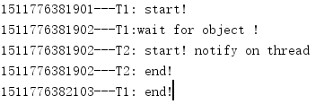

## 基本操作

### wait()和notify()

  为了支持多线程间的协作，增加的重要线程等待和通知方法。

    public final void wait() throws InterruptedException
    public final native void notify()

  当一个线程中的一个对象调用obj.wait()方法之后，当前线程就会在这个对象上进行等待，直到其他线程执行obj.notify()方法为止。这时obj对象就是多线程之间通信手段。

    public class SimpleWN {
      final static  Object object = new Object();
      static  class T1 extends Thread{
          @Override
          public void run() {
              System.out.println(System.currentTimeMillis()+"---T1: start!");
              try {
                  System.out.println(System.currentTimeMillis()+"---T1:wait for object !");
                  object.wait();
              } catch (InterruptedException e) {
                  e.printStackTrace();
              }
              System.out.println(System.currentTimeMillis()+"---T1: end!");
          }
      }

      static  class T2 extends Thread{
          @Override
          public void run() {
              System.out.println(System.currentTimeMillis()+"---T2: start! notify on thread ");
              object.notify();
              System.out.println(System.currentTimeMillis()+"---T2: end!");
              try {
                  Thread.sleep(200);
              } catch (InterruptedException e) {
                  e.printStackTrace();
              }
          }
      }

      public static void main(String[] args) {
          Thread t1 = new T1();
          Thread t2 = new T2();
          t1.start();
          t2.start();
      }
    }

  

  这里产生报错是因为一个对象可以调用notify方法前，首先对象需要调用wait()方法。

  因为做了下面的修改：

    public class SimpleWN {
        final static  Object object = new Object();
        static  class T1 extends Thread{
            @Override
            public void run() {
                synchronized (object){
                    System.out.println(System.currentTimeMillis()+"---T1: start!");
                    try {
                        System.out.println(System.currentTimeMillis()+"---T1:wait for object !");
                        object.wait();
                    } catch (InterruptedException e) {
                        e.printStackTrace();
                    }
                    System.out.println(System.currentTimeMillis()+"---T1: end!");
                }
            }
        }

        static  class T2 extends Thread{
            @Override
            public void run() {
                synchronized (object){
                    System.out.println(System.currentTimeMillis()+"---T2: start! notify on thread ");
                    object.notify();
                    System.out.println(System.currentTimeMillis()+"---T2: end!");
                    try {
                        Thread.sleep(200);
                    } catch (InterruptedException e) {
                        e.printStackTrace();
                    }

                }
            }
        }

        public static void main(String[] args) {
            Thread t1 = new T1();
            Thread t2 = new T2();
            t1.start();
            t2.start();
        }
    }

  

### 等待线程结束(join)和谦让(yield)

    public final void join() throws InterruptedException
    public final synchronized void join(long millis)
    public static native void yield();

  第一个join()会无限等待，它会阻塞当前进程，直到当前目标执行结束。第二个给出了最大等待的时间，如果超出了最大的等待时间，则会继续执行下去。yield()一旦执行会让出cpu,但是让出cpu并不表示线程不执行了，当前线程在让出cpu之后，还会进行cpu资源的争夺。但具体分配交由jvm来管理。

## JMM
### 内存模型
  

  （1）线程私有区：

  * 程序计数器，记录正在执行的虚拟机字节码的地址；
  * 虚拟机栈：方法执行的内存区，每个方法执行时会在虚拟机栈中创建栈帧；
  * 本地方法栈：虚拟机的Native方法执行的内存区；

（2）线程共享区：

  * Java堆：对象分配内存的区域；
  * 方法区：存放类信息、常量、静态变量、编译器编译后的代码等数据；
  * 常量池：存放编译器生成的各种字面量和符号引用，是方法区的一部分。

### 详细模型
Java内存总体结构图，以及各个区域的内容

  

### 程序计数器PC

  PC：指向当前线程所执行的字节码行号，每个线程拥有自己独立的PC

  当线程正在执行一个Java方法时，PC计数器记录的是正在执行的虚拟机字节码的地址；当线程正在执行的一个Native方法时，PC计数器则为空（Undefined）

### 虚拟机栈

  生命周期和线程相同，是Java方法执行的内存模型，每个方法（不包括native方法）执行的同时都会创建一个栈帧结构，方法执行过程，对应着虚拟机的入栈和出栈过程

#### 栈帧结构

  栈帧是用于支持虚拟机进行方法执行的数据结构，是属性运行时数据区的虚拟机站的栈元素。见上图， 栈帧包括：

  * 局部变量表 (locals大小，编译期确定)，一组变量存储空间， 容量以slot为最小单位
  * 操作栈(stack大小，编译期确定)，操作栈元素的数据类型必须与字节码指令序列严格匹配
  * 动态连接，指向运行时常量池中该栈帧所属方法的引用，为了动态连接使用。
    * 前面的解析过程其实是静态解析；
    * 对于运行期转化为直接引用，称为动态解析。
  * 方法返回地址
    * 正常退出，执行引擎遇到方法返回的字节码，将返回值传递给调用者
    * 异常退出，遇到Exception,并且方法未捕捉异常，那么不会有任何返回值。
  * 额外附加信息，虚拟机规范没有明确规定，由具体虚拟机实现。

### 本地方法栈

  本地方法栈为虚拟机使用到native方法提供内存空间，有些虚拟机的实现将本地方法栈和虚拟机栈合二为一。

### Java堆

  Java栈是jvm管理的最大的一块内存，也是gc主战场，里面存放对象的实例和数组的数据。

  * 从内存回收角度，Java堆被分为新生代和老年代；这样划分的好处是为了更快的回收内存；
  * 从内存分配角度，Java堆可以划分出线程私有的分配缓冲区(Thread Local Allocation Buffer,TLAB)；这样划分的好处是为了更快的分配内存；

### 方法区

  存放已经被虚拟机加载的类的信息，常量，静态变量，编译器编译后代码等数据，gc在改区域出现比较少

### 运行时常量池

  运行时常量池也是方法区的一部分，用于存放编译器生成的各种字面量和符号引用，运行时常量池除了编译期产生的class文件的常量池，还可以在运行期间，将新的常量加入常量池，例如String的intern()方法。

## 线程组

  分门别类对线程进行管理

    public class ThreadGroupName implements  Runnable {
        @Override
        public void run() {
            String groupName = Thread.currentThread().getThreadGroup().getName();
            while (true){
                System.out.println("I am " + groupName);
                try {
                    Thread.sleep(1000);
                } catch (InterruptedException e) {
                    e.printStackTrace();
                }
            }
        }

        public static void main(String[] args) {
            ThreadGroup group = new ThreadGroup("printGroup");
            Thread t1 = new Thread(group,new ThreadGroupName(),"T1");
            Thread t2 = new Thread(group,new ThreadGroupName(),"t2");
            t1.start();
            t2.start();
            //获得活动线程的总数，是一个估计值
            System.out.println(group.activeCount());
            //打印出这个线程组的所有线程信息
            group.list();
        }
    }

  *打印结果：*

  
