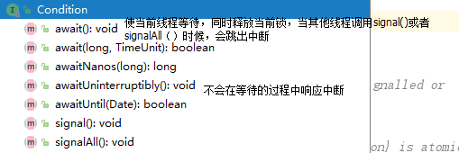
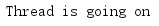

# 悲观锁

## synchronized
## 重入锁(ReentrantLock)
### 重入锁基本概念

    public class ReenterLock implements Runnable{
        private  static ReentrantLock lock = new ReentrantLock();
        private static  int i =0;
        @Override
        //手动设置何时加锁，何时解锁，灵活性比synchronized要好
        public void run() {
            for (int j = 0; j < 10000000; j++) {
                lock.lock();
                try {
                    i++;
                }finally {
                    lock.unlock();
                }
            }
        }
        public static void main(String[] args) throws InterruptedException {
            ReenterLock reenterLock = new ReenterLock();
            Thread t1 = new Thread(reenterLock);
            Thread t2 = new Thread(reenterLock);
            t1.start();
            t2.start();
            t1.join();
            t2.join();
            System.out.println("i == "+i);
        }
    }

  与synchronized相比，ReentrantLock加锁除了，获得锁，等待锁，还提供了一种可能，那就是线程可被中断，这个中断可以设置一个时间段，防止因为长期等待造成的饥饿或者死锁问题，如果不设置时间，则表示一直等待。

  在多数情况下，锁的申请都是非公平的，线程1先申请锁A,线程2后申请锁A,则当锁可被调度的时候，则选择线程1或者2是随机。如果想要公平算法的时候需要调用下面的构造函数

    public ReentrantLock(boolean fair);

  ReentrantLock重要方法总结

    //获得锁，如果被占用，则进行等待
    public void lock()
    //获得锁，优先响应中断
    public void lockInterruptibly() throws InterruptedException
    //尝试获得锁，如果成功则返回true,失败返回false,该方法不等待，立即返回
    public boolean tryLock()
    //在给定的时间内尝试获得锁
    public boolean tryLock(long timeout, TimeUnit unit)
    //释放锁
    public void unlock()

### 重入锁的好搭档：Condition条件

  利用Condition对象，就可以让线程在合适的时间等待，或者在某一个时间得到通知，继续执行。

  

  代码样例

    public class ReenterLockCondition implements Runnable{
        private  static ReentrantLock lock = new ReentrantLock(true);
        private static Condition condition = lock.newCondition();
        @Override
        public void run() {
            try {
                lock.lock();
                condition.await();
                System.out.println("Thread is going on ");
            } catch (InterruptedException e) {
                e.printStackTrace();
            } finally {
                lock.unlock();
            }
        }
        public static void main(String[] args) throws InterruptedException {
            ReenterLockCondition reenterLock = new ReenterLockCondition();
            Thread t1 = new Thread(reenterLock);
            t1.start();
            Thread.sleep(2000);
            //通知线程t1继续执行
            lock.lock();
            condition.signal();
            lock.unlock();
        }
    }

  *执行结果*

  

## Semphore(信号量)

  运行多个线程访问某一个资源

    //获得一个准入的许可，如果无法获得，则线程会等待，直到一个线程释放一个许可或者当前线程被中断。
    public void acquire() throws InterruptedException
    public void acquire(int permits) throws InterruptedException
    public void acquireUninterruptibly()
    //尝试获得一个许可，如果成功返回true,否则返回false;
    public boolean tryAcquire()
    public boolean tryAcquire(int permits)
    public boolean tryAcquire(int permits, long timeout, TimeUnit unit) throws InterruptedException
    //资源访问结束，释放一个许可
    public void release()

  样式展示

    public class SemaphoreDemo implements Runnable{
        final Semaphore semaphore = new Semaphore(4);
        @Override
        public void run() {
            try {
                semaphore.acquire();
                //模拟耗时操作
                Thread.sleep(2000);
                System.out.println(Thread.currentThread().getId()+"done!");
                semaphore.release();
            } catch (InterruptedException e) {
                e.printStackTrace();
            }
        }
        public static void main(String[] args) {
            ExecutorService service = Executors.newFixedThreadPool(20);
            final SemaphoreDemo demo = new SemaphoreDemo();
            for (int i = 0; i < 20; i++) {
                service.submit(demo);
            }
        }
    }

  *执行结果*

  每五个一起执行结束

## ReadWriteLock

  读写分离锁，有效帮助减少锁的竞争。

  读写锁之间的访问约束情况
  * 读-读不互斥：读读之间不阻塞
  * 读-写互斥：读阻塞写，写也会阻塞读
  * 写-写互斥：写写互斥

  案例分析

    public class ReadWriteLockDemo {
        private static ReentrantLock lock = new ReentrantLock();
        private static ReentrantReadWriteLock readWriteLock = new ReentrantReadWriteLock();
        private static Lock readLock = readWriteLock.readLock();
        private static  Lock writeLock = readWriteLock.writeLock();
        private  int value;

        public Object handleRead(Lock lock) throws InterruptedException {
            try {
                lock.lock();//模拟读操作
                System.out.println(Thread.currentThread().getName()+":模拟读操作");
                Thread.sleep(1000);//模拟读操作，耗时越多，则读写锁优势就越明显
                return  value;
            } finally {
                lock.unlock();
            }
        }

        public void handleWrite(Lock lock,int index ) throws InterruptedException {
            try {
                lock.lock();
                System.out.println(Thread.currentThread().getName()+":模拟写操作");
                Thread.sleep(1000); //模拟写操作耗时
                value = index;
            } finally {
                lock.unlock();
            }
        }

        public static void main(String[] args) {
            final ReadWriteLockDemo demo = new ReadWriteLockDemo();
            Runnable readRunnable = new Runnable() {
                @Override
                public void run() {
                    try {
                        demo.handleRead(readLock);
    //                    demo.handleRead(lock);
                    } catch (InterruptedException e) {
                        e.printStackTrace();
                    }
                }
            };
            Runnable writeRunnable = new Runnable() {
                @Override
                public void run() {
                    try {
                        Random random = new Random();
                        demo.handleWrite(readLock, random.nextInt());
    //                    demo.handleWrite(lock,random.nextInt());
                    } catch (InterruptedException e) {
                        e.printStackTrace();
                    }
                }
            };

            for (int i = 0; i < 18 ; i++) {
                new Thread(readRunnable).start();
            }
            for (int i = 0; i < 20 ; i++) {
                new Thread(writeRunnable).start();
            }
        }
    }

*结果*

    Thread-0:模拟读操作
    Thread-1:模拟读操作
    Thread-2:模拟读操作
    Thread-3:模拟读操作
    Thread-4:模拟读操作
    Thread-5:模拟读操作
    Thread-6:模拟读操作
    Thread-7:模拟读操作
    Thread-8:模拟读操作
    Thread-9:模拟读操作
    Thread-10:模拟读操作
    Thread-11:模拟读操作
    Thread-12:模拟读操作
    Thread-13:模拟读操作
    Thread-14:模拟读操作
    Thread-15:模拟读操作
    Thread-16:模拟读操作
    Thread-17:模拟读操作
    Thread-18:模拟写操作
    Thread-20:模拟写操作
    Thread-19:模拟写操作
    Thread-21:模拟写操作
    Thread-22:模拟写操作
    Thread-23:模拟写操作
    Thread-24:模拟写操作
    Thread-25:模拟写操作
    Thread-26:模拟写操作
    Thread-27:模拟写操作
    Thread-28:模拟写操作
    Thread-29:模拟写操作
    Thread-30:模拟写操作
    Thread-31:模拟写操作
    Thread-32:模拟写操作
    Thread-33:模拟写操作
    Thread-34:模拟写操作
    Thread-35:模拟写操作
    Thread-37:模拟写操作
    Thread-36:模拟写操作

  调换读写顺序

    for (int i = 0; i < 20 ; i++) {
        new Thread(writeRunnable).start();
    }
    for (int i = 0; i < 18 ; i++) {
        new Thread(readRunnable).start();
    }
*执行结果*

    Thread-0:模拟写操作
    Thread-1:模拟写操作
    Thread-2:模拟写操作
    Thread-3:模拟写操作
    Thread-4:模拟写操作
    Thread-5:模拟写操作
    Thread-6:模拟写操作
    Thread-7:模拟写操作
    Thread-8:模拟写操作
    Thread-9:模拟写操作
    Thread-11:模拟写操作
    Thread-10:模拟写操作
    Thread-12:模拟写操作
    Thread-13:模拟写操作
    Thread-14:模拟写操作
    Thread-15:模拟写操作
    Thread-16:模拟写操作
    Thread-17:模拟写操作
    Thread-18:模拟写操作
    Thread-19:模拟写操作
    Thread-20:模拟读操作
    Thread-21:模拟读操作
    Thread-22:模拟读操作
    Thread-23:模拟读操作
    Thread-24:模拟读操作
    Thread-25:模拟读操作
    Thread-26:模拟读操作
    Thread-27:模拟读操作
    Thread-29:模拟读操作
    Thread-28:模拟读操作
    Thread-30:模拟读操作
    Thread-31:模拟读操作
    Thread-32:模拟读操作
    Thread-33:模拟读操作
    Thread-34:模拟读操作
    Thread-35:模拟读操作
    Thread-36:模拟读操作
    Thread-37:模拟读操作

## CountDownLatch

  非常常用的多线程控制类，用来控制线程等待，它可以让一个线程等待直到倒计时结束，再开始执行。

例子：

    public class CountDownLatchDemo implements Runnable {
        static final CountDownLatch end = new CountDownLatch(10);
        static final CountDownLatchDemo demo = new CountDownLatchDemo();
        @Override
        public void run() {
            //模拟检测任务
            try {
                Thread.sleep(new Random().nextInt(10)*1000);
                System.out.println("check complete");
                end.countDown();
                System.out.println(Thread.currentThread().getName()+"task complete");
            } catch (InterruptedException e) {
                e.printStackTrace();
            }
        }
        public static void main(String[] args) throws InterruptedException {
            ExecutorService service = Executors.newFixedThreadPool(10);
            for (int i = 0; i < 10; i++) {
                service.submit(demo);
            }
            //等待检查
            end.await();
            //发射火箭
            System.out.println("Fire!!!");
            service.shutdown();
        }
    }

*运行结果*

    check complete
    pool-1-thread-10task complete
    check complete
    pool-1-thread-1task complete
    check complete
    pool-1-thread-6task complete
    check complete
    check complete
    pool-1-thread-9task complete
    pool-1-thread-7task complete
    check complete
    pool-1-thread-8task complete
    check complete
    pool-1-thread-3task complete
    check complete
    pool-1-thread-2task complete
    check complete
    pool-1-thread-4task complete
    check complete
    pool-1-thread-5task complete
    Fire!!!

## CyclicBarrier

  功能和CountDownLatch相似，但是功能更为丰富，意为循环计数器的意思

  代码分析

    public class CyclicBarrierDemo implements  Runnable{
        private String soldier;
        private CyclicBarrier cyclic;
        public CyclicBarrierDemo(String soldier, CyclicBarrier cyclic) {
            this.soldier = soldier;
            this.cyclic = cyclic;
        }

        @Override
        public void run() {
            try {
                //等待所有士兵到齐
                cyclic.await();
                dowork();
                cyclic.await();
                //等待所有士兵完成任务
            } catch (InterruptedException e) {
                e.printStackTrace();
            } catch (BrokenBarrierException e) {
                e.printStackTrace();
            }
        }

        private void dowork() {
            try {
                Thread.sleep(1000);
            } catch (InterruptedException e) {
                e.printStackTrace();
            }
            System.out.println(Thread.currentThread().getName()+":完成任务");
        }
        static class BarrierRun implements Runnable {
            boolean flag;
            int N ;
            public BarrierRun(boolean flag, int n) {
                this.flag = flag;
                N = n;
            }
            @Override
            public void run() {
                if(flag){
                    System.out.println("司令：[士兵"+N+"个,完成任务]");
                }else {
                    System.out.println("司令：[士兵"+N+"个,集合完毕]");
                }
            }
        }
        public static void main(String[] args) {
            final int N = 10;
            Thread [] allSoldiers = new Thread[2*N];
            boolean flag = false;
            CyclicBarrier cyclic = new CyclicBarrier(N,new BarrierRun(flag,N));
            //设置屏障点，主要为了执行这个任务
            System.out.println("队伍集合");
            for (int i = 0; i < 2*N; i++) {
                System.out.println("士兵"+i+"报道!");
                allSoldiers[i] = new Thread(new CyclicBarrierDemo("士兵"+i,cyclic));
                allSoldiers[i].start();
            }
        }
    }

*测试结果*

    队伍集合
    士兵0报道!
    ...
    司令：[士兵10个,集合完毕]
    Thread-9:完成任务
    ...
    司令：[士兵10个,完成任务]

## LockSupport(线程阻塞工具类)

  可以让线程在认为位置阻塞，不需要获得某个资源锁

    public class LockSupportDemo {
        public static Object object = new Object();
        private static ChangeObjectThread t1 = new ChangeObjectThread("t1");
        private static ChangeObjectThread t2 = new ChangeObjectThread("t2");
        static class ChangeObjectThread  extends Thread{
            public ChangeObjectThread (String name){
                super.setName(name);
            }
            @Override
            public void run() {
                synchronized (object) {
                    System.out.println("in "+ getName());
                    LockSupport.park();
                }
            }
        }
        public static void main(String[] args) throws InterruptedException {
            t1.start();
            Thread.sleep(1000);
            t2.start();
            LockSupport.unpark(t1);
            LockSupport.unpark(t2);
            t1.join();
            t2.join();
            System.out.println("执行结束!");
        }
    }

*执行结果*

    in t1
    in t2
    执行结束!

## ThreadLocal

# 乐观锁

## 实现算法（CAS）

  CAS:它包含三个参数CAS(V,E,N)。V代表要更新的值，E代表预期的值，N代表新值。仅当V==E的时候，才会将V设置成N，如果不同，则说明已经有其他线程正在修改该值，则当前线程什么都不做。失败的该线程不会被挂起，仅仅被告知失败，并且允许再次尝试，当然也可以放弃操作。

## 无锁线程的安全整数AtomicInteger

  例子

    public class AtomicIntegetDemo  {
        static AtomicInteger  i = new AtomicInteger();

        public static class AddThread implements  Runnable {
            @Override
            public void run() {
                for (int j = 0; j < 10000; j++) {
                  //这里的操作内部实现compareAndSet(current,next)。就是在使用cas来保证线程使用的安全性
                    i.incrementAndGet();
                }
            }
        }

        public static void main(String[] args) throws InterruptedException {
            Thread [] threads = new Thread[10];
            for (int j = 0; j < 10; j++) {
                threads[j] = new Thread(new AddThread());
            }
            for (int j = 0; j < 10; j++) {
                threads[j].start();
            }
            for (int j = 0; j < 10; j++) {
                threads[j].join();
            }
            System.out.println("i==" +i);
        }
    }

*运行结果*

    i==100000

## 无锁对象的引用(AtomicReference)

  乐观锁比较的是当前值与预期值是否相同，但如果对同一个变量实施2次变换，变换之后结果不变，这时候对于cas算法来说就不够准确了，它仅仅比较变换之后的结果，不考虑变换过程中的状态变化。这里的无锁的对象引用就会存在没有状态的问题

    /**
     * 一个蛋糕店展开一次促销活动，为会员卡里余额小于20元的会员一次性充值20元，但是条件是一个会员只能充值一次
     */
    public class AtomicReferenceDemo {
        static AtomicReference<Integer> money = new AtomicReference<>(19);
        public static void main(String[] args) {
            //模拟多个线程更新后台
            for (int i = 0; i < 3; i++) {
                new Thread(){
                    @Override
                    public void run() {
                        while (true){
                            Integer m = money.get();
                            if(m<20){
                                if(money.compareAndSet(m,m+20)){
                                    System.out.println(Thread.currentThread().getId()+"****  余额小于20元，充值成功，余额："+money.get()+"元");
                                }else {
                                    System.out.println("余额大于20元，"+money.get()+"元");
                                }
                            }
                        }
                    }
                }.start();
            }
        //用户消费进程，用于模仿消费行为
            new Thread(){
                @Override
                public void run() {
                    for (int i = 0; i < 100; i++) {
                        while (true){
                            Integer m =money.get();
                            if(m>10){
                                System.out.println("大于10元");
                                if(money.compareAndSet(m,m-10)){
                                    System.out.println("成功消费10元，余额："+money.get());
                                    break;
                                } else {
                                    System.out.println("没有足够的金额");
                                    break;
                                }
                            }
                            try {
                                Thread.sleep(100);
                            } catch (InterruptedException e) {
                                e.printStackTrace();
                            }
                        }
                    }
                }
            }.start();
        }
    }

*结果分析*

可以看出，这个账号前后被反复多次充值，其原因是在于反复修改。修改后的值等于原有的数值，使得cas操作无法正确判断目前状态

## 带有时间戳的对象引用
这个方法内部实现不仅仅维护了对象值，还维护了一个时间戳（其实它可以是使用一个整数来记录状态值）。

## 数组中的无锁使用

  案例分析

    public class AtomicIntegerArrayDemo {
        static AtomicIntegerArray arr = new AtomicIntegerArray(10);
        public static class AddThread implements Runnable {

            @Override
            public void run() {
                for (int i = 0; i < 10000; i++) {
                    //将下标i的元素+1
                    arr.getAndIncrement(i%arr.length());
                }
            }
        }

        public static void main(String[] args) throws InterruptedException {
            Thread [] threads = new Thread[10];
            for (int i = 0; i < 10; i++) {
                threads[i] = new Thread(new AddThread());
            }
            for (int i = 0; i < 10; i++) {
                threads[i].start();
            }
            for (int i = 0; i < 10; i++) {
                threads[i].join();
            }
            System.out.println(arr);
        }
    }

*案例分析*

## 普通变量当成原子操作

## 挑战无锁算法：无锁实现Vector实现
