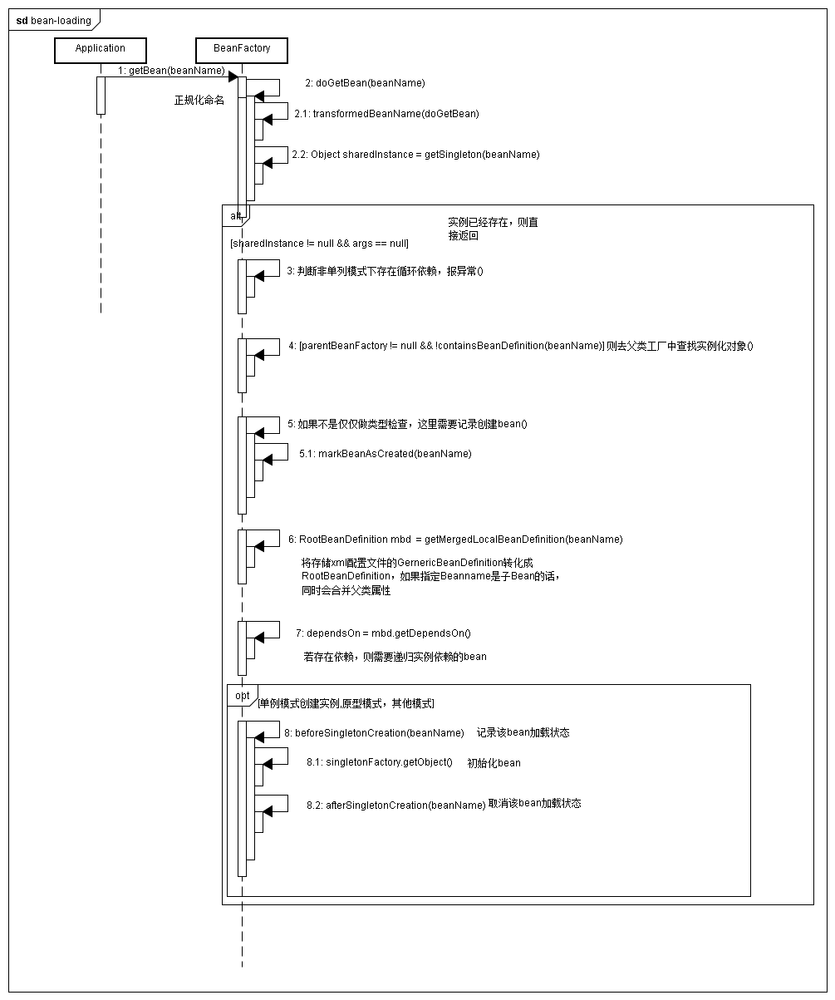

## 视图分析

## 代码分析

* 解析bean

    protected void processBeanDefinition(Element ele, BeanDefinitionParserDelegate delegate) {
      //元素解析，bdHolder实例包含配置文件中各种属性，如class,name,id,alias
		BeanDefinitionHolder bdHolder = delegate.parseBeanDefinitionElement(ele);
		if (bdHolder != null) {
      //当bdHolder不为空的时候，再次解析自定义标签
			bdHolder = delegate.decorateBeanDefinitionIfRequired(ele, bdHolder);
			try {
				// Register the final decorated instance.
				BeanDefinitionReaderUtils.registerBeanDefinition(bdHolder, getReaderContext().getRegistry());
			}
			catch (BeanDefinitionStoreException ex) {
				getReaderContext().error("Failed to register bean definition with name '" +
						bdHolder.getBeanName() + "'", ele, ex);
			}
			// 发出响应事件，通知相关监听器，这个bean已经加载完成
			getReaderContext().fireComponentRegistered(new BeanComponentDefinition(bdHolder));
		}
	}

* 元素解析

    public BeanDefinitionHolder parseBeanDefinitionElement(Element ele) {
		return parseBeanDefinitionElement(ele, null);
	}
    public BeanDefinitionHolder parseBeanDefinitionElement(Element ele, BeanDefinition containingBean) {
      //解析id属性
  		String id = ele.getAttribute(ID_ATTRIBUTE);
      //解析name属性
  		String nameAttr = ele.getAttribute(NAME_ATTRIBUTE);
      //分割name属性
  		List<String> aliases = new ArrayList<String>();
  		if (StringUtils.hasLength(nameAttr)) {
  			String[] nameArr = StringUtils.tokenizeToStringArray(nameAttr, MULTI_VALUE_ATTRIBUTE_DELIMITERS);
  			aliases.addAll(Arrays.asList(nameArr));
  		}

  		String beanName = id;
  		if (!StringUtils.hasText(beanName) && !aliases.isEmpty()) {
  			beanName = aliases.remove(0);
  			if (logger.isDebugEnabled()) {
  				logger.debug("No XML 'id' specified - using '" + beanName +
  						"' as bean name and " + aliases + " as aliases");
  			}
  		}
      //检测获取bean是否加入到jdk中，加入则忽略
  		if (containingBean == null) {
  			checkNameUniqueness(beanName, aliases, ele);
  		}
      //进一步解析其他所有属性并统一封装到GenerateBeanDefinition中
  		AbstractBeanDefinition beanDefinition = parseBeanDefinitionElement(ele, beanName, containingBean);
      //如果不存在beanName那么根据spring提供的命名规则为当前bean生成对应的beanName
  		if (beanDefinition != null) {
  			if (!StringUtils.hasText(beanName)) {
  				try {
  					if (containingBean != null) {
  						beanName = BeanDefinitionReaderUtils.generateBeanName(
  								beanDefinition, this.readerContext.getRegistry(), true);
  					}
  					else {
  						beanName = this.readerContext.generateBeanName(beanDefinition);
  						// Register an alias for the plain bean class name, if still possible,
  						// if the generator returned the class name plus a suffix.
  						// This is expected for Spring 1.2/2.0 backwards compatibility.
  						String beanClassName = beanDefinition.getBeanClassName();
  						if (beanClassName != null &&
  								beanName.startsWith(beanClassName) && beanName.length() > beanClassName.length() &&
  								!this.readerContext.getRegistry().isBeanNameInUse(beanClassName)) {
  							aliases.add(beanClassName);
  						}
  					}
  					if (logger.isDebugEnabled()) {
  						logger.debug("Neither XML 'id' nor 'name' specified - " +
  								"using generated bean name [" + beanName + "]");
  					}
  				}
  				catch (Exception ex) {
  					error(ex.getMessage(), ele);
  					return null;
  				}
  			}
  			String[] aliasesArray = StringUtils.toStringArray(aliases);
  			return new BeanDefinitionHolder(beanDefinition, beanName, aliasesArray);
  		}

  		return null;
  	}

* 标签其他属性解析过程

    public AbstractBeanDefinition parseBeanDefinitionElement(
			Element ele, String beanName, BeanDefinition containingBean) {

		this.parseState.push(new BeanEntry(beanName));

		String className = null;
    //解析class属性
		if (ele.hasAttribute(CLASS_ATTRIBUTE)) {
			className = ele.getAttribute(CLASS_ATTRIBUTE).trim();
		}

		try {
      //解析parent属性
			String parent = null;
			if (ele.hasAttribute(PARENT_ATTRIBUTE)) {
				parent = ele.getAttribute(PARENT_ATTRIBUTE);
			}
      //创建用于继承属性AbstractBeanDefinition类型的GenericBeanDefinition
			AbstractBeanDefinition bd = createBeanDefinition(className, parent);
      //硬编码解析默认bean各种属性
			parseBeanDefinitionAttributes(ele, beanName, containingBean, bd);

			bd.setDescription(DomUtils.getChildElementValueByTagName(ele, DESCRIPTION_ELEMENT));
      //解析元数据
			parseMetaElements(ele, bd);
      //解析lookup-method属性
			parseLookupOverrideSubElements(ele, bd.getMethodOverrides());
      //解析repalce-method属性
			parseReplacedMethodSubElements(ele, bd.getMethodOverrides());
      //解析析构函数
			parseConstructorArgElements(ele, bd);
      //解析Property属性元素
			parsePropertyElements(ele, bd);
      //解析Qualifier属性元素
			parseQualifierElements(ele, bd);

			bd.setResource(this.readerContext.getResource());
			bd.setSource(extractSource(ele));

			return bd;
		}
		catch (ClassNotFoundException ex) {
			error("Bean class [" + className + "] not found", ele, ex);
		}
		catch (NoClassDefFoundError err) {
			error("Class that bean class [" + className + "] depends on not found", ele, err);
		}
		catch (Throwable ex) {
			error("Unexpected failure during bean definition parsing", ele, ex);
		}
		finally {
			this.parseState.pop();
		}

		return null;
	}

* 生成beanName

    public static String generateBeanName(
			BeanDefinition definition, BeanDefinitionRegistry registry, boolean isInnerBean)
			throws BeanDefinitionStoreException {

		String generatedBeanName = definition.getBeanClassName();
		if (generatedBeanName == null) {
			if (definition.getParentName() != null) {
				generatedBeanName = definition.getParentName() + "$child";
			}
			else if (definition.getFactoryBeanName() != null) {
				generatedBeanName = definition.getFactoryBeanName() + "$created";
			}
		}
		if (!StringUtils.hasText(generatedBeanName)) {
			throw new BeanDefinitionStoreException("Unnamed bean definition specifies neither " +
					"'class' nor 'parent' nor 'factory-bean' - can't generate bean name");
		}

		String id = generatedBeanName;
		if (isInnerBean) {
			// Inner bean: generate identity hashcode suffix.
			id = generatedBeanName + GENERATED_BEAN_NAME_SEPARATOR + ObjectUtils.getIdentityHexString(definition);
		}
		else {
			// Top-level bean: use plain class name.
			// Increase counter until the id is unique.
			int counter = -1;
			while (counter == -1 || registry.containsBeanDefinition(id)) {
				counter++;
				id = generatedBeanName + GENERATED_BEAN_NAME_SEPARATOR + counter;
			}
		}
		return id;
	}
