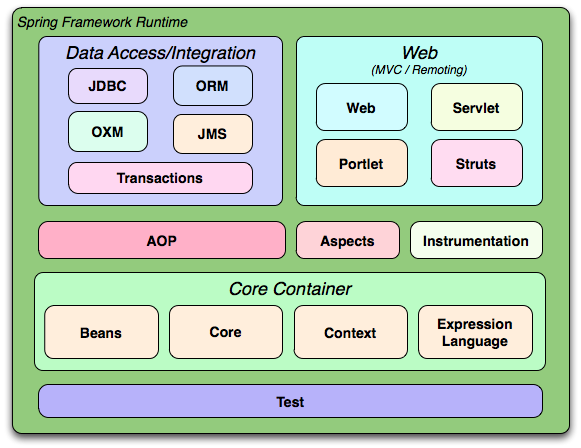

## spring 基本概念

### spring 基本结构

### spring解析原理
xml 配置文件--> GenericBeanDefinition(xml所有配置都可以在GenericBeanDefinition中找到相应配置)

#### 基本模块分析

- Core Container

  - Core 封装了框架依赖的最底层部分，包括资源访问、类型转换及一些常用工具类。
  - Beans 包含访问配置文件，创建和管理bean以及进行IOC,AOP操作相关的所有类
  - Context: 提供对象访问方法，国际化，事件传播，资源加载，对Context的透明创建的支持，EJB，JMX，RMI的处理
  - Expression Language 提供强大的表达式语言用于在运行时查询，操作对象。（获得对象属性（值），方法调用,访问数组，容器，索引器，逻辑，算术运算器）

- Data Access/Integration

  - JDBC 封装数据访问的所有类
  - ORM 为对象-关系提供映射API
  - OXM 提供Object/XML映射实现抽象层，包括JAXB,Castor,XMLBeans,JiBX,XStream
  - JMS 制造和消费消息特性
  - Transaction 支持编程和声明式事物管理

- Web

  - Web：提供面向Web的集成特性（多文件长传，使用servlet listeners初始化，IOC容器以及面向Web上下文管理）
  - Servlet：包含spring - mvc实现
  - Structs：提供structs的支持
  - Porlet：提供Porlet环境和Web-Servlet的模块实现。

- AOP

  - 提供AspectJ的集成支持
  - Instrumentation模块提供了class instrumentation支持和classLoader实现，是的可以在特定的应用服务器上使用

- Test

  - 提供junit 和 TestNG的支持
