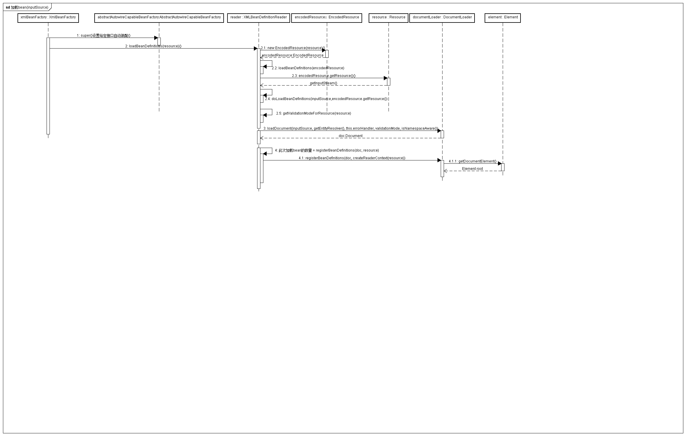

# Bean容器初始化

## 图形说明

## 使用

s
    BeanFactory bf = new XmlBeanFactory(new ClassPathResource("applicationContext.xml"));
    MytestBean mytestBean = (MytestBean) bf.getBean("mytestBean");

* 加载过程

    //工厂初始化
    public XmlBeanFactory(Resource resource, BeanFactory parentBeanFactory) throws BeansException {
    		super(parentBeanFactory);
    		this.reader.loadBeanDefinitions(resource);
    }

  - 实例化过程

      //忽略给定接口的自动装配功能
      public AbstractAutowireCapableBeanFactory() {
  		super();
  		ignoreDependencyInterface(BeanNameAware.class);
  		ignoreDependencyInterface(BeanFactoryAware.class);
  		ignoreDependencyInterface(BeanClassLoaderAware.class);
  	}

  - 对资源文件进行编码处理

    public int loadBeanDefinitions(Resource resource) throws BeanDefinitionStoreException {
  		return loadBeanDefinitions(new EncodedResource(resource) //对资源文件进行编码处理);
  	}

  - 加载资源

    public int loadBeanDefinitions(EncodedResource encodedResource) throws BeanDefinitionStoreException {
		Assert.notNull(encodedResource, "EncodedResource must not be null");
		if (logger.isInfoEnabled()) {
			logger.info("Loading XML bean definitions from " + encodedResource.getResource());
		}

      //通过属性来记录加载的资源
		Set<EncodedResource> currentResources = this.resourcesCurrentlyBeingLoaded.get();
		if (currentResources == null) {
			currentResources = new HashSet<EncodedResource>(4);
			this.resourcesCurrentlyBeingLoaded.set(currentResources);
		}
		if (!currentResources.add(encodedResource)) {
			throw new BeanDefinitionStoreException(
					"Detected cyclic loading of " + encodedResource + " - check your import definitions!");
		}
		try {
      //从encodedResource中获取已经封装的Resource对象并再次从Resource中获取inputStream
			InputStream inputStream = encodedResource.getResource().getInputStream();
			try {
        //InputSource这个类不是来自spring，它的全路径是org.xml.sax.InputSource
				InputSource inputSource = new InputSource(inputStream);
				if (encodedResource.getEncoding() != null) {
					inputSource.setEncoding(encodedResource.getEncoding());
				}
        //真正加载资源
				return doLoadBeanDefinitions(inputSource, encodedResource.getResource());
			}
			finally {
				inputStream.close();
			}
		}
		catch (IOException ex) {
			throw new BeanDefinitionStoreException(
					"IOException parsing XML document from " + encodedResource.getResource(), ex);
		}
		finally {
			currentResources.remove(encodedResource);
			if (currentResources.isEmpty()) {
				this.resourcesCurrentlyBeingLoaded.remove();
			}
		}
	}

  - 数据准备阶段

    protected int doLoadBeanDefinitions(InputSource inputSource, Resource resource)
			throws BeanDefinitionStoreException {
		try {
      //获取指定资源的验证模式（DTD,XTD）
			int validationMode = getValidationModeForResource(resource);
      //加载指定资源，并得到对应的Document（使用sax解析xml）,EntityResolver提供寻找DTD声明方法
			Document doc = this.documentLoader.loadDocument(
					inputSource, getEntityResolver(), this.errorHandler, validationMode, isNamespaceAware());
      //提取并且注册Document中的bean
      return registerBeanDefinitions(doc, resource);
		}
		catch (BeanDefinitionStoreException ex) {
			throw ex;
		}
		catch (SAXParseException ex) {
			throw new XmlBeanDefinitionStoreException(resource.getDescription(),
					"Line " + ex.getLineNumber() + " in XML document from " + resource + " is invalid", ex);
		}
		catch (SAXException ex) {
			throw new XmlBeanDefinitionStoreException(resource.getDescription(),
					"XML document from " + resource + " is invalid", ex);
		}
		catch (ParserConfigurationException ex) {
			throw new BeanDefinitionStoreException(resource.getDescription(),
					"Parser configuration exception parsing XML from " + resource, ex);
		}
		catch (IOException ex) {
			throw new BeanDefinitionStoreException(resource.getDescription(),
					"IOException parsing XML document from " + resource, ex);
		}
		catch (Throwable ex) {
			throw new BeanDefinitionStoreException(resource.getDescription(),
					"Unexpected exception parsing XML document from " + resource, ex);
		}
	}

  - 验证模式

    protected int getValidationModeForResource(Resource resource) {
		int validationModeToUse = getValidationMode();
    // 如果手动指定验证模式，则使用指定的验证模式
		if (validationModeToUse != VALIDATION_AUTO) {
  			return validationModeToUse;
		}
    //未指定使用自动检测,通过识别xml文件头来识别是xsd,还是dtd文件
		int detectedMode = detectValidationMode(resource);
		if (detectedMode != VALIDATION_AUTO) {
			return detectedMode;
		}
		// Hmm, we didn't get a clear indication... Let's assume XSD,
		// since apparently no DTD declaration has been found up until
		// detection stopped (before finding the document's root tag).
		return VALIDATION_XSD;
	}

  - 检测模式

    protected int detectValidationMode(Resource resource) {
    //判断资源文件是否可以多线程同时读，如果不能则其他返回true
		if (resource.isOpen()) {
			throw new BeanDefinitionStoreException(
					"Passed-in Resource [" + resource + "] contains an open stream: " +
					"cannot determine validation mode automatically. Either pass in a Resource " +
					"that is able to create fresh streams, or explicitly specify the validationMode " +
					"on your XmlBeanDefinitionReader instance.");
		}

		InputStream inputStream;
		try {
			inputStream = resource.getInputStream();
		}
		catch (IOException ex) {
			throw new BeanDefinitionStoreException(
					"Unable to determine validation mode for [" + resource + "]: cannot open InputStream. " +
					"Did you attempt to load directly from a SAX InputSource without specifying the " +
					"validationMode on your XmlBeanDefinitionReader instance?", ex);
		}

		try {
			return this.validationModeDetector.detectValidationMode(inputStream);
		}
		catch (IOException ex) {
			throw new BeanDefinitionStoreException("Unable to determine validation mode for [" +
					resource + "]: an error occurred whilst reading from the InputStream.", ex);
		}
	}

  - 解析注册BeanDefinitions

    public int registerBeanDefinitions(Document doc, Resource resource) throws BeanDefinitionStoreException {
      //实例化文件解析器
		BeanDefinitionDocumentReader documentReader = createBeanDefinitionDocumentReader();
		documentReader.setEnvironment(this.getEnvironment());
		int countBefore = getRegistry().getBeanDefinitionCount();
    //加载，注册bean
		documentReader.registerBeanDefinitions(doc, createReaderContext(resource));
    //返回解析这个文件新生成的bean
		return getRegistry().getBeanDefinitionCount() - countBefore;
	}

  - 加载，注册bean

    public void registerBeanDefinitions(Document doc, XmlReaderContext readerContext) {
  		this.readerContext = readerContext;

  		logger.debug("Loading bean definitions");
  		Element root = doc.getDocumentElement();
      //加载，注册bean
  		doRegisterBeanDefinitions(root);
  	}

    protected void doRegisterBeanDefinitions(Element root) {
      //处理profile属性
		String profileSpec = root.getAttribute(PROFILE_ATTRIBUTE);
		if (StringUtils.hasText(profileSpec)) {
			Assert.state(this.environment != null, "environment property must not be null");
			String[] specifiedProfiles = StringUtils.tokenizeToStringArray(profileSpec, BeanDefinitionParserDelegate.MULTI_VALUE_ATTRIBUTE_DELIMITERS);
			if (!this.environment.acceptsProfiles(specifiedProfiles)) {
				return;
			}
		}

		// any nested <beans> elements will cause recursion in this method. In
		// order to propagate and preserve <beans> default-* attributes correctly,
		// keep track of the current (parent) delegate, which may be null. Create
		// the new (child) delegate with a reference to the parent for fallback purposes,
		// then ultimately reset this.delegate back to its original (parent) reference.
		// this behavior emulates a stack of delegates without actually necessitating one.
		BeanDefinitionParserDelegate parent = this.delegate;
		this.delegate = createHelper(readerContext, root, parent);

		preProcessXml(root);
		parseBeanDefinitions(root, this.delegate);
		postProcessXml(root);

		this.delegate = parent;
	}
