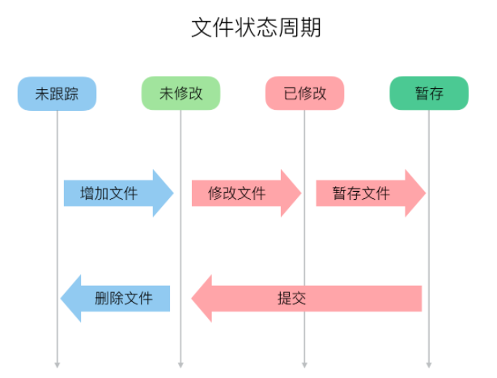

## 操作步骤
  @author ktine

  @git帮助文档 https://coding.net/help/

***本文基于coding所做的项目代码管理***

## 使用前准备

  * 初始化设置

        $ git config --global user.name gitaccount
        $ git config --global user.email gitaccount@example.com

  * 查看设置之后的内容

        1. cat ~/.gitconfig
        2. git config --global user.name
           git config --global user.email
        3. 代码库中配置文件中查看：
           cat .git/config

   * 取消全局配置
        1. git config --global --unset user.name
        2. git config --global --unset user.email

  * 设置ssh key

        ssh-keygen -t rsa -C "your_email@example.com"

        -t 指定密钥类型，默认是 rsa ，可以省略。
        -C 设置注释文字，比如邮箱。
        -f 指定密钥文件存储文件名。

  * 添加公钥

        参考网站：https://coding.net/help/doc/git/ssh-key.html

## 基本操作

  * 初始化仓库

        git  init   

  * 查看仓库操作

        git status
        git clone <url>      克隆远程版本库

  * 向暂存区中添加文件

        git add . 跟踪所有改动过的文件
        git add remoteName(origin) git@git.coding.net:ktine/store.git
        已修改（modified）、已暂存（staged）、已提交（committed）

  * 保存仓库中历史记录

        git commit -m "submit instructions"
        -m 对这次提交的代码所做说明

  * 查看提交日志

        git log 显示目录下的提交信息(常用使用场景：代码提交后为了保证代码提交成功)
        git log README.md 显示该文件的提交记录
        git log -p README.md 查看提交README.md的提交日志以及提交前后的差别说明
        git blame <file>           以列表方式查看指定文件的提交历史

  * 代码比较

        查看暂存区与代码库的区别
        git diff a/README.md b/README.md
        查看本次提交与上次提交的区别
        git diff HEAD

  * 推送远程仓库

        git remote add url
        git push remoteName(origin) master //实际上是把本地的master
        分支推送到了远程仓库，相当于在远程有了一个代码仓库的备份

  * 获取远程仓库代码
        git pull remoteName(origin) master

  * 代码回滚

        git reset --hard HEAD      #撤销工作目录中所有未提交文件的修改内容
        git checkout HEAD <file>   #撤销指定的未提交文件的修改内容
        git revert <commit>        #撤销指定的提交
        git log --before="1 days"  #退回到之前1天的版本

  * 远程操作

        git remote -v                   #查看远程版本库信息
        git remote show <remote>        #查看指定远程版本库信息
        git remote add <remote> <url>   #添加远程版本库
        git fetch <remote>              #从远程库获取代码
        git pull <remote> <branch>      #下载代码及快速合并
        git push <remote> <branch>      #上传代码及快速合并
        git push <remote> :<branch/tag-name>  #删除远程分支或标签
        git push --tags                       #上传所有标签

  * 添加远程关联

        git remote add ktine git@git.coding.net:ktine/store.git

  * 本地分支与远程分支关联，并推送到远程仓库

        git push --set-upstream ktine master
