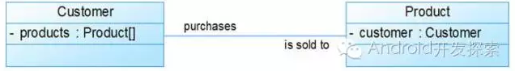

# 类图

## 类的属性的表示方式

在UML类图中，类使用包含类名、属性（field）和方法（method）且带有分隔线的矩形来表示，比如下图表示一个Employee类，它包含name、age和email这3个属性，以及modifyInfo()方法。

UML类图中表示可见性的符号有三种：
* '+': 表示public
* '-': 表示private
* '#': 表示protected（friendly也归入这类）

## 类的方法的表示方式

方法的完整表示方式如下：
可见性 名称(参数列表) [ : 返回类型]
同样，中括号中的内容是可选的。

比如在下图的Demo类中，定义了3个方法：

* public方法method1接受一个类型为Object的参数，返回值类型为void。
* protected方法method2无参数，返回值类型为String。
* private方法method3接收类型分别为int、int[]的参数，返回值类型为int。

## 类与类之间关系的表示方式
1. 关联关系

  关联关系又可进一步分为单向关联、双向关联和自关联。

  （1）单向关联

  我们可以看到，在UML类图中单向关联用一个带箭头的直线表示。上图表示每个顾客都有一个地址，这通过让Customer类持有一个类型为Address的成员变量来实现。

  
  （2）双向关联

  从上图中我们很容易看出，所谓的双向关联就是双方各自持有对方类型的成员变量。在UML类图中，双向关联用一个不带箭头的直线来表示。上图中在Customer类中维护一个Product[]数组表示一个顾客购买了哪些产品；在Product类中维护一个Customer类型的成员变量表示这个产品被那个顾客所购买。

  
  （3）自关联

  自关联在UML类图中用一个带有箭头且指向自身的直线表示。上图的意思就是Node类包含类型为Node的成员变量，也就是“自己包含自己”。

  

2. 聚合关系

  
  上图中的Car类与Engine类就是聚合关系（Car类中包含一个Engine类型的成员变量）。由上图我们可以看到，UML中聚合关系用带空心菱形和箭头的直线表示。聚合关系强调是“整体”包含“部分”，但是“部分”可以脱离“整体”而单独存在。比如上图中汽车包含了发动机，而发动机脱离了汽车也能够单独存在。

3. 组合关系

  组合关系与聚合关系间的最大不同在于：这里的“部分”脱离了“整体”便不复存在。比如下图：

  
  显然，嘴是头的一部分且不能脱离了头而单独存在。在UML类图中，组合关系用一个带实心菱形和箭头的直线表示。

4. 依赖关系

    
    从上图中我们可以看到，Driver的drive方法只有传入了一个Car对象才能发挥作用，因此我们说Driver类依赖于Car类。在UML类图中，依赖关系用一条带有箭头的虚线表示。

5. 继承关系

  继承关系对应的是extend关键字，在UML类图中用带空心三角形的直线表示，如下图所示中，Student类与Teacher类继承了Person类。

  

6. 接口实现关系

  这种关系对应implements关键字，比如下图中，Car类与Ship类都实现了Vehicle接口。
  
