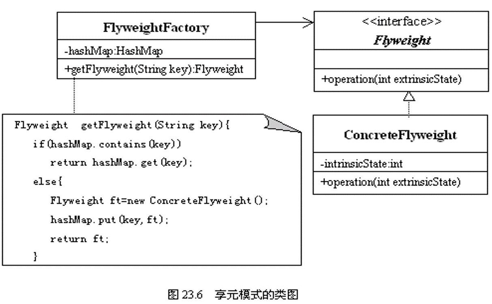

## 定义

    对于一个系统的大量相同的对象，避免每次使用都去创建，把这些资源统一进行管理，这个管理类可以理解为享元工厂，这些对象理解为具体享元

### 使用场景：

  池的概念

## 角色

- 享元接口（Flyweight）
- 具体享元（Concrete Flyweight）
- 享元工厂（Flyweight Factory）

### UML

  

## 案列分析

### 代码实现

      1．享元接口（Flyweight）: Flyweight.java
      public interface Flyweight{
           public double getHeight();  
           public double getWidth();
           public double getLength();
           public void printMess(String mess);
      }

      2．享元工厂（FlyweightFactory）与具体享元_2: FlyweightFactory.java
      class ConcreteFlyweight implements Flyweight{  
                   private double width;
                   private double height;
                   private double length;
                   private ConcreteFlyweight(double width,double height,double length){
                         this.width=width;
                         this.height=height;
                         this.length=length;
                  }
                  public double getHeight(){
                         return height;
                  }
                  public double getWidth(){
                         return width;
                  }
                  public double getLength(){
                         return length;
                 }
                 public void printMess(String mess){
                       System.out.print(mess);       
                       System.out.print(" 宽度："+width);
                       System.out.print(" 高度："+height);
                       System.out.println("长度："+length);
                 }
            }
      }

      3．享元工厂（FlyweightFactory）与具体享元_1: FlyweightFactory.java
      import java.util.HashMap;
      public class FlyweightFactory{
             private   HashMap<String,Flyweight>  hashMap;
             static  FlyweightFactory factory=new FlyweightFactory();
             private FlyweightFactory(){
                   hashMap=new HashMap<String,Flyweight>();
             }
             public static FlyweightFactory getFactory(){
                   return factory;
             }
             public synchronized Flyweight getFlyweight(String key){
                  if(hashMap.containsKey(key))
                             return hashMap.get(key);
                  else{
                            double width=0,height=0,length=0;
                            String [] str=key.split("#");
                            width=Double.parseDouble(str[0]);
                            height=Double.parseDouble(str[1]);
                            length=Double.parseDouble(str[2]);
                            Flyweight ft=new ConcreteFlyweight(width,height,length);
                            hashMap.put(key,ft);
                            return ft;
                  }
             }
      }

      4．应用_1:  Car.java
      public class Car{
           Flyweight  flyweight;  
           String name,color;
           int power;
           Car(Flyweight flyweight,String name,String color,int power){
                 this.flyweight=flyweight;
                 this.name=name;
                 this.color=color;
                 this.power=power;
           }
          public void print(){
                System.out.print(" 名称："+name);
                System.out.print(" 颜色："+color);
                System.out.print(" 功率："+power);
                System.out.print(" 宽度："+flyweight.getWidth());
                System.out.print(" 高度："+flyweight.getHeight());
                System.out.println("长度："+flyweight.getLength());
           }
      }

## 评价
- 对比工厂模式

  第一次看到享元模式的时候发现享元模式就像工厂模式，但是具体分析，二者差距还是挺大的。工厂模式是创建性设计模式，享元模式是一种结构性设计模式。工厂模式在于创建对象，而享元模式在于使用管理资源，使用资源，这些资源，一次创建多次使用，这一点就与工厂模式有本质的区别。
