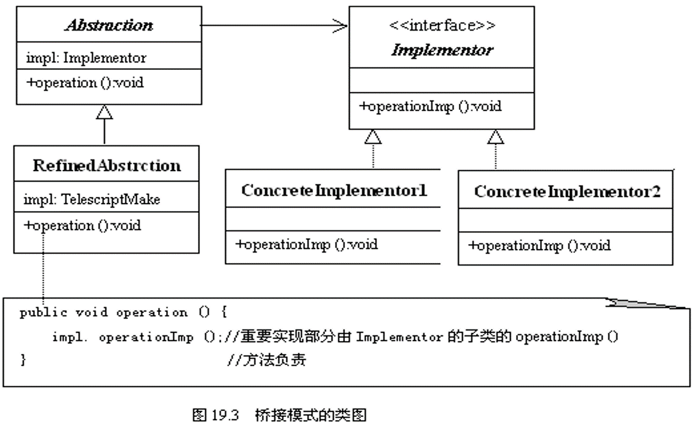

## 定义

    将抽象部分与它的实现部分分离，使得它们都可以独立地变化。

### 使用场景：

    桥接模式是关于怎样将抽象部分与它的实现部分分离，使得它们都可以独立地变化的成熟模式。

## 角色

- 抽象（Abstraction）
  - 定义抽象类的接口
  - 维护一个指向Implementor类型对象的指针。
- 细化抽象（Refined Abstraction）
  - 扩充由Abstraction定义的接口。
- 实现者(Implementor)
  - 定义实现类的接口，该接口不一定要与Abstraction的接口完全一致；事实上这两个
接口可以完全不同。一般来讲，Implementor接口仅提供基本操作，而Abstraction则
定义了基于这些基本操作的较高层次的操作。
- 具体实现者(ConcreteImplementor)
  - 实现Implementor接口并定义它的具体实现。

### UML

  

## 案列分析

### 代码实现

    1．抽象（Abstraction）: ArchitectureCose.java
    public abstract class  ArchitectureCost{
          BuildingDesign  design;
          double unitPrice;
          public  abstract double giveCost() ;
    }

    2．细化抽象（Refined Abstraction）：BuildingCose.java
    public  class  BuildingCost extends ArchitectureCost{
          BuildingCost(BuildingDesign design,double unitPrice){
                 this.design=design;
                 this.unitPrice=unitPrice;
          }
          public  double giveCost() {
                double area=design.computerArea();
                return area*unitPrice;
          }
    }

    3．实现者（Implementor） : BuildingDesign.java
    public interface BuildingDesign{
          public double computerArea();  
     }

    4．具体实现者（Concrete Implementor）：HouseDesign.java
    public class HouseDesign implements BuildingDesign{
          double width,length;
          int floorNumber;
          HouseDesign(double width,double length,int floorNumber){
                this.width=width;
                this.length=length;
                this.floorNumber=floorNumber;
          }
          public double computerArea(){
                return width*length*floorNumber;
          }
      }

    5．应用 Application.java
     public class Application{
         public static void main(String args[]) {
               double width=63,height=30;
               int floorNumber=8;
               double unitPrice=6867.38;
               BuildingDesign  design=new HouseDesign(width,height,floorNumber);
               System.out.println("宽"+width+"米，高"+height+"米，层数为"+floorNumber);
               ArchitectureCost  cost=new BuildingCost(design,unitPrice);
               double price=cost.giveCost();
               System.out.printf("每平米造价："+unitPrice+"元的商业楼的建设成本：%.2f元\n",price);
               width=52;
               height=28;
               floorNumber=6;
               unitPrice=2687.88;
               design=new HouseDesign(width,height,floorNumber);
               System.out.println("宽"+width+"米，高"+height+"米，层数为"+floorNumber);
               cost=new BuildingCost(design,unitPrice);
               price=cost.giveCost();
               System.out.printf("每平米造价："+unitPrice+"元的住宅楼的建设成本：%.2f元\n",price);
         }
    }

## 评价
- 优点
  1. 桥接模式分离实现与抽象，使得抽象和实现可以独立的扩展。当修改实现的代码时，不影响抽象的代码，反之也一样。
- 缺点
  1. 享元模式享元模式
