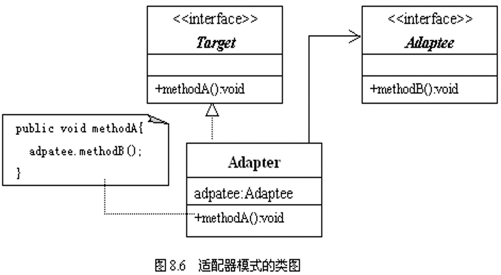

## 定义

    将一个类的接口转换成客户希望的另外一个接口。

### 使用场景：

    Adapter模式使得原本由于接口不兼容而不能一起工作的那些类可以一起工作。

## 角色

  - 目标（Target）
    - 定义client使用的与特定领域相关的接口。
  - 被适配器者(Adaptee)
    -  定义一个已经存在的接口，这个接口需要适配。
  - 适配器(Adapter)
    - 对Adaptere的接口与Target接口进行适配

### UML

  

## 案列分析

### 代码实现

    1．目标（Target） : ThreeElectricOutlet.java
    public interface ThreeElectricOutlet{
        public abstract void connectElectricCurrent();
    }

    2．被适配者（Adaptee）: TwoElectricOutlet.java
    public interface TwoElectricOutlet{
        public abstract void connectElectricCurrent();
     }

    3．适配器（Adapter） TreeElectricAdapter.java
    public class TreeElectricAdapter implements ThreeElectricOutlet{
       TwoElectricOutlet outlet;
       TreeElectricAdapter(TwoElectricOutlet outlet){
           this.outlet=outlet;
       }
       public void connectElectricCurrent(){
           outlet.connectElectricCurrent();
       }
    }

    4.定义3孔洗衣机
    class Wash implements ThreeElectricOutlet{
        String name;
        Wash(){
           name="黄河洗衣机";
        }
        Wash(String s){
           name=s;
        }
        public void connectElectricCurrent(){
           turnOn();
        }
        public void turnOn(){
           System.out.println(name+"开始洗衣物。");
        }
    }

    5．定义2孔洗衣机
     class TV implements TwoElectricOutlet{  
        String name;
        TV(){
           name="长江电视机";
        }
        TV(String s){
           name=s;
        }
        public void connectElectricCurrent(){
           turnOn();
        }
        public void turnOn(){
           System.out.println(name+"开始播放节目。");
        }
    }  

    6. 应用 Application.java
     public class Application{
        public static void main(String args[]){
           ThreeElectricOutlet outlet;      
           Wash wash=new Wash();            
           outlet=wash;                      
           System.out.println("使用三相插座接通电流：");
           outlet.connectElectricCurrent();   
           TV tv=new TV();                    
           TreeElectricAdapter adapter=new TreeElectricAdapter(tv);
           outlet=adapter;                   
           System.out.println("使用三相插座接通电流：");
           outlet.connectElectricCurrent();   
        }
    }

## 评价
- 优点
  1. 更好的复用性
    1. 系统需要使用现有的类，而此类的接口不符合系统的需要。那么通过适配器模式就可以让这些功能得到更好的复用。
  2. 更好的拓展性
    1. 在实现适配器功能的时候，可以调用自己开发的功能，从而自然地扩展系统的功能。
- 缺点
  - 过多的使用适配器，会让系统非常零乱，不易整体进行把握。比如，明明看到调用的是A接口，其实内部被适配成了B接口的实现，一个系统如果太多出现这种情况，无异于一场灾难。因此如果不是很有必要，可以不使用适配器，而是直接对系统进行重构。
