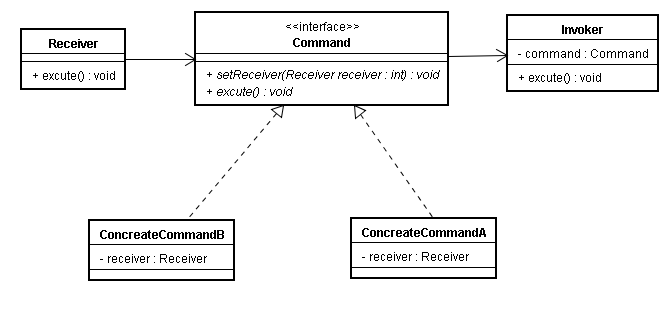

## 定义

    将一个请求封装为一个对象，从而使你可用不同的请求对客户进行参数化；对请求排队或记录请求日志，以及支持可撤消的操作。

### 使用场景：

    命令模式首先具有单一的方法接口，然后从该接口实现具有各自不同的行为的多个子类。

## 角色

- 接收者（Receiver）
- 命令(Command)接口
- 具体命令（ConcreteCommand）
- 请求者（Invoker）

### UML

  

## 案列分析

### 代码实现

      1．接收者（Receiver） : CompanyArmy.java

      public class CompanyArmy{
         public void sneakAttack(){
            System.out.println("我们知道如何偷袭敌人,保证完成任务");
         }
      }
      2．命令（Command）接口 : Command.java

      public interface Command {
         public abstract void execute();
      }
      3．具体命令（ConcreteCommand） ConcreteCommand.java

      public class ConcreteCommand implements Command{
         CompanyArmy army;           //含有接收者的引用
         ConcreteCommand(CompanyArmy army){
            this.army=army;
         }
         public  void execute(){    //封装着指挥官的请求
            army.sneakAttack();     //偷袭敌人  
         }
      }
      4．请求者（Invoker） ArmySuperior.java

      public class ArmySuperior{
        Command command;          //用来存放具体命令的引用
        public void setCommand(Command command){
           this.command=command;
        }
        public void startExecuteCommand(){
                           //让具体命令执行execute()方法
           command.execute();
        }
      }
      5．应用 Application.java

       public class Application{
         public static void main(String args[]){
            CompanyArmy 三连=new CompanyArmy();         
            Command command=new ConcreteCommand("三连");
            ArmySuperior 指挥官=new ArmySuperior();     
            指挥官.setCommand(command);                 
            指挥官.startExecuteCommand();
         }
      }

## 评价
- 优点

  1.
- 缺点
