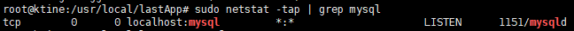

## ubuntu 服务器环境安装
*建议：强迫症患者需要把下面的解压文档重命名，去掉后缀数字*
### JDK安装
#### 安装包安装方式
1. tar zxvf ./jdk-8u101-linux-x64.tar.gz
2. 设置环境变量
vim /etc/profile
export JAVA_HOME=/usr/local/lastApp/jdk1.7.0_71
export JRE_HOME=${JAVA_HOME}/jre
export CLASSPATH=.:${JAVA_HOME}/lib:${JRE_HOME}/lib
export PATH=.:${JAVA_HOME}/bin:$PATH
3. 为了让更改立即生效，请在终端执行如下命令：
source /etc/profile 或者 source ~/.bashrc
4. 验证是否安装成功 java -version

### 安装tomcat
1. 解压tomcat : tar -zxvf apache-tomcat-7.0.77.tar.gz  
2. 设置环境变量：sudo vim /etc/profile  
3. 在文件末尾中加入：
#set tomcat environment  
CATALINA_HOME=/usr/local/lastApp/apache-tomcat-7.0.57
export CATALINA_HOME
4. 编辑catalina.sh文件:
vim bin/catalina.sh
5. 编辑tomca运行环境,在文档前面加入:
CATALINA_HOME=/usr/local/lastApp/apache-tomcat-7.0.57  
JAVA_HOME=/usr/local/lastApp/jdk1.7.0_71
6. 为了让更改立即生效，请在终端执行如下命令：
source /etc/profile 或者 source ~/.bashrc

### 安装mysql
#### 在线安装mysql
1. 安装依赖包
sudo apt-get install cmake,
sudo apt-get install libncurses5-dev
2. mysql
sudo  apt-get install mysql-server,
sudo  apt-get install mysql-client,
sudo  apt-get install libmysqlclient-dev
3. 查看是否安装成功:  sudo netstat -tap | grep mysql

这样的显示结果代表安装成功
4. 查看mysql版本
mysqladmin -u root -p version
4. 启动mysql:sudo service mysql start

### 安装redis
#### 离线安装redis
https://blog.csdn.net/zstack_org/article/details/69951845s
