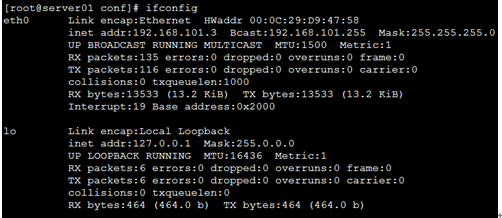
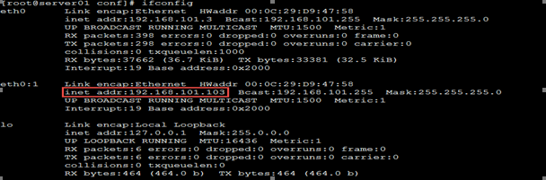
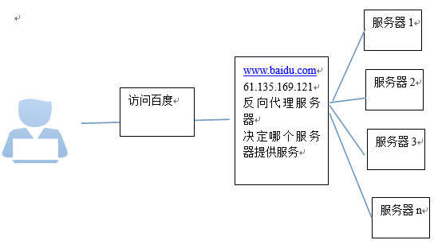
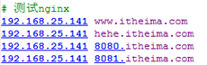
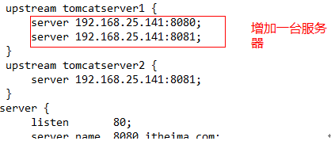
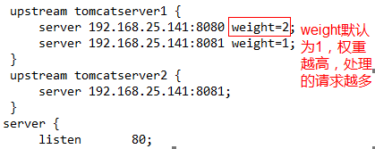

## nginx

### nginx安装

1. 如果涉及到本地测试环境，可以直接将防火墙关掉，减少开启端口操作

2. 具体安装过程：http://www.cnblogs.com/taiyonghai/p/6728707.html

### nginx 环境安装

1. http服务器。Nginx是一个http服务可以独立提供http服务。可以做网页静态服务器。
* 虚拟主机。可以实现在一台服务器虚拟出多个网站。例如个人网站使用的虚拟主机。
* 反向代理，负载均衡。当网站的访问量达到一定程度后，单台服务器不能满足用户的请求时，需要用多台服务器集群可以使用nginx做反向代理。并且多台服务器可以平均分担负载，不会因为某台服务器负载高宕机而某台服务器闲置的情况。

#### http服务器

#### 虚拟主机

  可以实现在同一台服务运行多个网站，而且网站之间互相不干扰。

  区分不同网站的方式

  区分不同的网站有三种方式：

  1. ip
  *  端口号
  *  域名区分
##### IP区分

  需要一台服务器绑定多个ip地址。

  方法一：
  使用标准的网络配置工具（比如ifconfig和route命令）添加lP别名：

  当前ip配置情况：

   

  在eth0网卡再绑定一个ip：192.168.101.103

  /sbin/ifconfig eth0:1 192.168.101.103 broadcast 192.168.101.255 netmask 255.255.255.0 up
  /sbin/route add -host 192.168.101.103 dev eth0:1

  

  方法二：
  1、将/etc/sysconfig/network-scripts/ifcfg-eth0文件复制一份，命名为ifcfg-eth0:1
  修改其中内容：
  DEVICE=eth0:1
  IPADDR=otherAdreess(192.168.0.2)
  其他项不用修改
  2、重启系统

###### 案例：配置nginx基于ip地址的虚拟主机

  打开nginx配置文件，添加一个server配置

     server {
        listen       80;
        server_name  192.168.25.141;

        #charset koi8-r;

        #access_log  logs/host.access.log  main;

        location / {
            root   html-141 # 请求服务的根目录;
            index  index.html index.htm # 目标请求服务;
        }
    }

    server {
        listen       80;
        server_name  192.168.25.100;

        #charset koi8-r;

        #access_log  logs/host.access.log  main;

        location / {
            root   html-100;
            index  index.html index.htm;
        }
    }

##### 基于端口的虚拟主机

      server {
        listen       81;
        server_name  192.168.25.141;
        #charset koi8-r;
        #access_log  logs/host.access.log  main;
        location / {
            root   html-81;
            index  index.html index.htm;
        }
    }

    server {
        listen       82;
        server_name  192.168.25.141;
        #charset koi8-r;
        #access_log  logs/host.access.log  main;
        location / {
            root   html-82;
            index  index.html index.htm;
        }
    }

##### 基于域名的虚拟主机

    server {
          listen       80;
          server_name  www.itheima.com;
          #charset koi8-r;
          #access_log  logs/host.access.log  main;
          location / {
              root   html-www;
              index  index.html index.htm;
          }
      }

      server {
          listen       80;
          server_name  hehe.itheima.com;
          #charset koi8-r;
          #access_log  logs/host.access.log  main;
          location / {
              root   html-hehe;
              index  index.html index.htm;
          }
      }

#### 反向代理

  代理定义图：
  

  Nginx只做请求的转发，后台有多个http服务器提供服务，nginx的功能就是把请求转发给后面的服务器，决定把请求转发给谁。

###### 案例

  1. 安装tomcat
      在一个虚拟机上创建两个tomcat实例，模拟多个服务器。

  2. 需求
      通过访问不同的域名访问运行在不同端口的tomcat
      8080.itheima.com	访问运行8080端口的tomcat
      8081.itheima.com	访问运行8081端口的tomcat

  3. 配置本地的hosts
      C:\Windows\System32\drivers\etc\hosts:dns

  4. 或者使用SwithHosts工具编辑

      语法规则： 

  5. nginx配置

    upstream tomcatserver1 {
      server 192.168.25.141:8080;
    }
    upstream tomcatserver2 {
      server 192.168.25.141:8081;
    }
    server {
      listen       80;
      server_name  8080.itheima.com;
      #charset koi8-r;
      #access_log  logs/host.access.log  main;
      location / {
          proxy_pass   http://tomcatserver1;
          index  index.html index.htm;
      }
    }
    server {
      listen       80;
      server_name  8081.itheima.com;
      #charset koi8-r;
      #access_log  logs/host.access.log  main;
      location / {
          proxy_pass   http://tomcatserver2;
          index  index.html index.htm;
      }
    }

#### 负载均衡

 定义： 将服务分摊到多个操作单元上进行执行，例如Web服务器、FTP服务器、企业关键应用服务器和其它关键任务服务器等，从而共同完成工作任务。

##### 配置nginx的负载均衡

  

##### 配置负载均衡的权重

  

##### 节点说明

  节点说明：
在http节点里添加:

#定义负载均衡设备的 Ip及设备状态

      upstream myServer {   
          server 127.0.0.1:9090 down;
          server 127.0.0.1:8080 weight=2;
          server 127.0.0.1:6060;
          server 127.0.0.1:7070 backup;
      }
      在需要使用负载的Server节点下添加
      proxy_pass http://myServer;
      upstream 每个设备的状态:
      down 表示单前的server暂时不参与负载
      weight  默认为1.weight越大，负载的权重就越大。
      max_fails ：允许请求失败的次数默认为1.当超过最大次数时，返回proxy_next_upstream 模块定义的错误
      fail_timeout:max_fails 次失败后，暂停的时间。
      backup： 其它所有的非backup机器down或者忙的时候，请求backup机器。所以这台机器压力会最轻。
